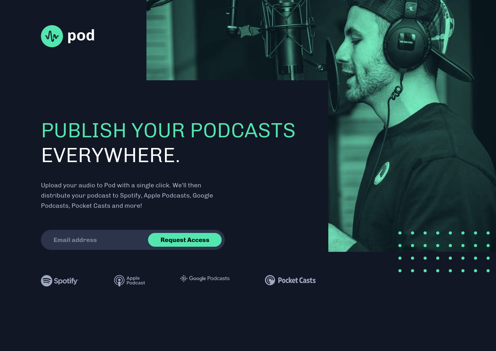

# Frontend Mentor - Pod request access landing page solution

## The challenge

I think most of the challenge was with the background images. I'm not too used to them so getting them to cooperate was a little challenging at first.

### Screenshot

## What I learned

My first time trying the webbrowser for changing text size and learning a little bit about why rem matters and also when I shouldn't use them. Also tested a screen reader to see how it works. Not sure if it is a good one but gives me an idea of how they work. I think.
